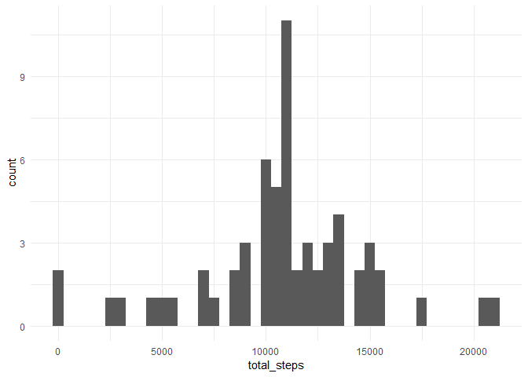
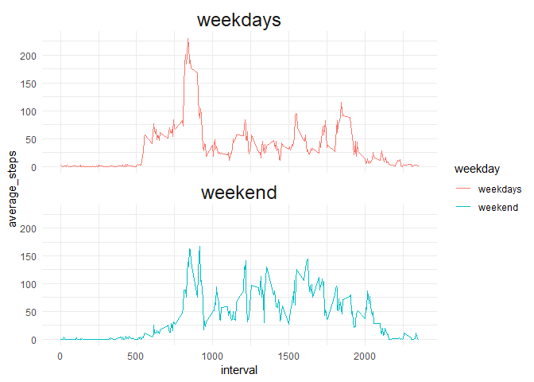

## loading libraries

```r
library(tidyverse)
```

```
## -- Attaching packages -------------------------------------------------------------------------------------- tidyverse 1.2.1 --
```

```
## v ggplot2 3.0.0     v purrr   0.2.5
## v tibble  1.4.2     v dplyr   0.7.6
## v tidyr   0.8.1     v stringr 1.3.1
## v readr   1.1.1     v forcats 0.3.0
```

```
## -- Conflicts ----------------------------------------------------------------------------------------- tidyverse_conflicts() --
## x dplyr::filter() masks stats::filter()
## x dplyr::lag()    masks stats::lag()
```

```r
library(ggplot2)
library(lubridate)
```

```
## 
## Attaching package: 'lubridate'
```

```
## The following object is masked from 'package:base':
## 
##     date
```

## Loading and preprocessing the data

```r
unzip("activity.zip")
activity <- read.csv("activity.csv")

summary(activity)
```

```
##      steps                date          interval     
##  Min.   :  0.00   2012-10-01:  288   Min.   :   0.0  
##  1st Qu.:  0.00   2012-10-02:  288   1st Qu.: 588.8  
##  Median :  0.00   2012-10-03:  288   Median :1177.5  
##  Mean   : 37.38   2012-10-04:  288   Mean   :1177.5  
##  3rd Qu.: 12.00   2012-10-05:  288   3rd Qu.:1766.2  
##  Max.   :806.00   2012-10-06:  288   Max.   :2355.0  
##  NA's   :2304     (Other)   :15840
```

## What is mean total number of steps taken per day?

```r
df_activity_by_day <- activity %>% 
  group_by(date) %>%
  summarize(total_steps=sum(steps, na.rm = TRUE))

mean_total_steps_by_day <- mean(df_activity_by_day$total_steps)
median_total_steps_by_day <- median(df_activity_by_day$total_steps)
```

The mean of total number of steps taken by day is : 9354.2295082 steps.
The median is : 10395.


```r
ggplot(df_activity_by_day, aes(total_steps)) +
  theme_minimal() +
  geom_histogram( binwidth = 500, stat = "bin", na.rm = TRUE)
```

<!-- -->


## What is the average daily activity pattern?


```r
df_activity_by_interval <- activity %>% 
  group_by(interval) %>%
  summarize(average_steps=mean(steps, na.rm = TRUE))
print(head(df_activity_by_interval))
```

```
## # A tibble: 6 x 2
##   interval average_steps
##      <int>         <dbl>
## 1        0        1.72  
## 2        5        0.340 
## 3       10        0.132 
## 4       15        0.151 
## 5       20        0.0755
## 6       25        2.09
```

```r
max_average_steps_by_interval <- max(df_activity_by_interval$average_steps)
index_interval_max <- df_activity_by_interval$interval[which.max(df_activity_by_interval$average_steps)]
```

The max of average number of steps taken by interval is : 206.1698113 steps for the interval 835


```r
ggplot(df_activity_by_interval, aes(interval)) +
  theme_minimal() +
  geom_line( aes(y= average_steps))
```

<!-- -->


```r
ggplot(df_activity_by_interval, aes(average_steps)) +
  theme_minimal() +
  geom_histogram( binwidth = 5, stat = "bin", na.rm = TRUE)
```

<!-- -->


## Imputing missing values


```r
na_count <- length(which(is.na(activity$steps)))
```

There is 2304 NAs value in the steps column.

Replace NA values with average step of the 5-min interval

```r
activity_removed_miss <- activity
v <- which(is.na(activity$steps))

find_interval_average <- function (x, df, column1, column2) { 
  index <- grep(pattern = paste("^",x,"$",sep=""), 
     df[[column1]], 
     value = FALSE
      )
  # print(head(list))
  return(df[index, column2])
  # return(column2)
}

interval_name <- activity$interval[v]
activity_removed_miss$steps[v] <- as.vector(sapply(interval_name, find_interval_average, df_activity_by_interval, "interval","average_steps"), mode = "numeric")

summary(activity_removed_miss)
```

```
##      steps                date          interval     
##  Min.   :  0.00   2012-10-01:  288   Min.   :   0.0  
##  1st Qu.:  0.00   2012-10-02:  288   1st Qu.: 588.8  
##  Median :  0.00   2012-10-03:  288   Median :1177.5  
##  Mean   : 37.38   2012-10-04:  288   Mean   :1177.5  
##  3rd Qu.: 27.00   2012-10-05:  288   3rd Qu.:1766.2  
##  Max.   :806.00   2012-10-06:  288   Max.   :2355.0  
##                   (Other)   :15840
```

Compute the total number of steps by day

```r
new_df_total_steps_by_day <- activity_removed_miss %>%
  group_by(date) %>%
  summarize(total_steps = sum(steps))

new_mean_total_steps_by_day  <- mean(new_df_total_steps_by_day$total_steps)
new_median_total_steps_by_day <- median(new_df_total_steps_by_day$total_steps)
```

The **mean** of total number of steps taken by day is : 1.0766189\times 10^{4} steps (old value with NAs : 9354.2295082).
The **median** is : 1.0766189\times 10^{4} (old value: 10395.)

**Histogram** of the total number of steps by day

```r
ggplot(new_df_total_steps_by_day, aes(x=total_steps))+
  theme_minimal() +
  geom_histogram(binwidth = 500)
```

<!-- -->


## Are there differences in activity patterns between weekdays and weekends?


```r
activity_removed_miss$weekday <- activity_removed_miss$date
activity_removed_miss$weekday <- (lubridate::wday(as.Date(activity_removed_miss$weekday),week_start = 1))

v <- activity_removed_miss$weekday == 6 | activity_removed_miss$weekday == 7
activity_removed_miss$weekday[v] <- "weekend"
activity_removed_miss$weekday[!v] <- "weekdays"
activity_removed_miss$weekday <- factor(activity_removed_miss$weekday)

summary(activity_removed_miss)
```

```
##      steps                date          interval          weekday     
##  Min.   :  0.00   2012-10-01:  288   Min.   :   0.0   weekdays:12960  
##  1st Qu.:  0.00   2012-10-02:  288   1st Qu.: 588.8   weekend : 4608  
##  Median :  0.00   2012-10-03:  288   Median :1177.5                   
##  Mean   : 37.38   2012-10-04:  288   Mean   :1177.5                   
##  3rd Qu.: 27.00   2012-10-05:  288   3rd Qu.:1766.2                   
##  Max.   :806.00   2012-10-06:  288   Max.   :2355.0                   
##                   (Other)   :15840
```

```r
new_df_total_steps_by_interval <- activity_removed_miss %>%
  group_by(interval,weekday) %>%
  summarize(average_steps = mean(steps))

ggplot(new_df_total_steps_by_interval, aes(interval, colour = weekday )) +
  facet_grid(. ~ weekday) +
  theme_minimal() +
  geom_line( aes(y= average_steps))
```

<!-- -->

Plot with time series combined


```r
ggplot(new_df_total_steps_by_interval, aes(interval, colour = weekday )) +

  theme_minimal() +
  geom_line( aes(y= average_steps))
```

<!-- -->

